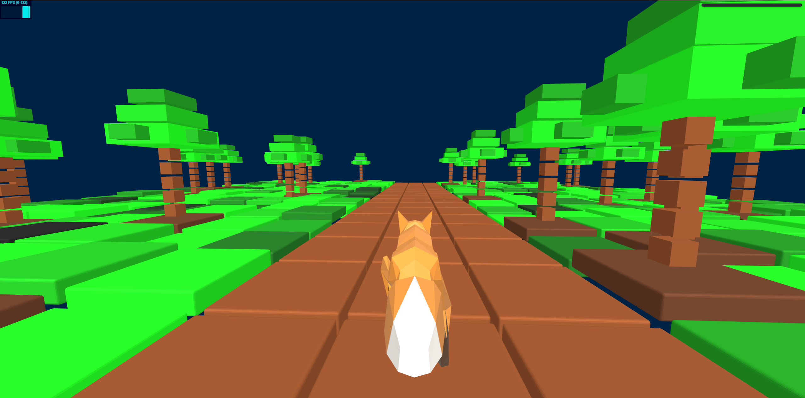

# Infinite Running 🚀



**Infinite Running** is a Three.js project inspired by endless runner games like *Subway Surfers*. It features a dynamically generated environment where the player continuously moves forward, dodging obstacles and collecting rewards.

The core gameplay loop emphasizes fast-paced action, smooth character movement, and procedurally created terrain to ensure variety and replayability.

----

## Tech for Real-Time Rendering

**WebGL 2.0** – The primary rendering API used in this project, providing access to GPU-accelerated graphics within the browser.

**Three.js** – A powerful and widely-used JavaScript library for 3D graphics, simplifying the process of creating and rendering 3D scenes in the browser. Three.js serves as the core framework for rendering geometries and GLTF models.

---

## Installation

```bash
git clone https://github.com/amitdubey6261/Infinite-Running-
npm install
npm run dev
```

---